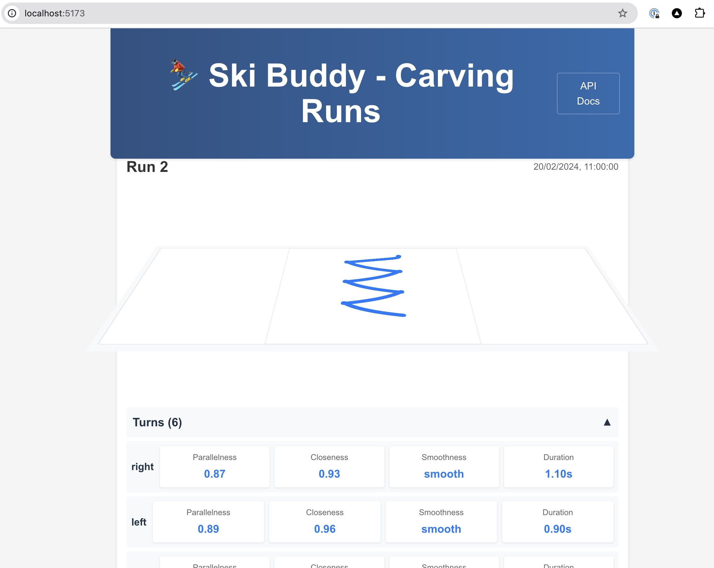

# Ski Buddy

A web application for managing ski-related activities and data.



## Prerequisites

- Docker and Docker Compose
- Make (optional, for using Make commands)

## Running the Application

### Using Docker Compose

1. Start all services:
```bash
docker-compose up -d
```

2. Access the web interface at http://localhost:5173
3. The API will be available at http://localhost:8080/api

To stop the services:
```bash
docker-compose down
```

### Using Make (Recommended)

The project includes a Makefile with convenient commands for common operations:

1. Start all services and open the web interface:
```bash
make all
```

2. Start services without opening the browser:
```bash
make up
```

3. Stop all services:
```bash
make down
```

4. Clean build artifacts and remove volumes:
```bash
make clean
```

5. Rebuild Docker images:
```bash
make build
```

### Additional Make Commands

- `make fmt`: Format both Rust and web code
- `make test`: Run tests for both backend and frontend

## Project Structure

- `web/`: Frontend application
- `src/`: Backend API code
- `Dockerfile.api`: Backend Docker configuration
- `docker-compose.yml`: Service orchestration
- `Makefile`: Build and development commands

## Environment Variables

The application uses environment variables from the `.env` file. Make sure it exists and contains the necessary configuration.

## Development

The application consists of two main services:
- Frontend: Running on port 5173
- Backend API: Running on port 8080

Both services are containerized and can be managed through Docker Compose or Make commands. 